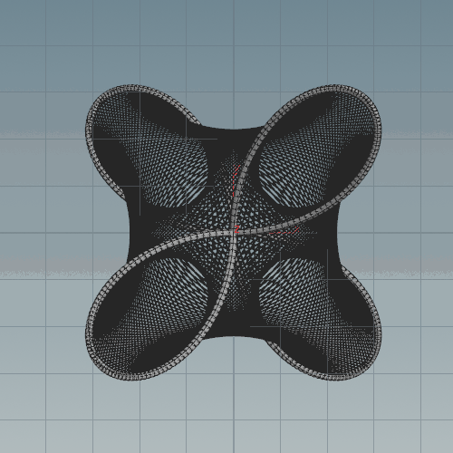
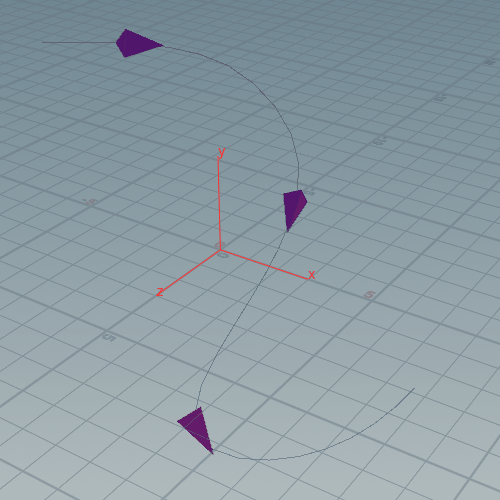

# VEX
### Random Walk (randomWalk.hipnc)


### Collatz Conjecture (collatzConjecture.hipnc)


### Rotation (rotation.hipnc)


### Maurer Rose (maurerRose.hipnc)


### Move Along Curve (move_along_curve.hipnc)


### Quilling (quilling.hipnc)


### Feather Gen (feather_gen.hipnc)


### VEX Header Files (vex_header.hipnc)
###### Header File fx_tools.h (Header file location \houdiniXX.X\vex\include\fx_tools.h)
```
int compare_vectors(vector p1, p2; float threshold){
	if(abs(dot(p1,p2)) > 1- threshold){
		return 1;
	}else{
		return 0;
	}
}
```
###### Include In Wrangle Node
```
#include <fx_tools.h>

printf("%d",compare_vectors(@P,point(1,"P",3),0.1));
```


